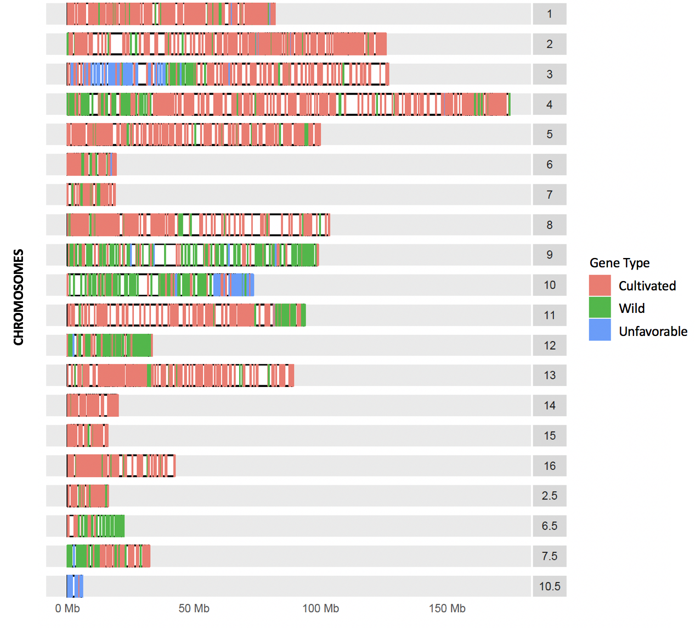
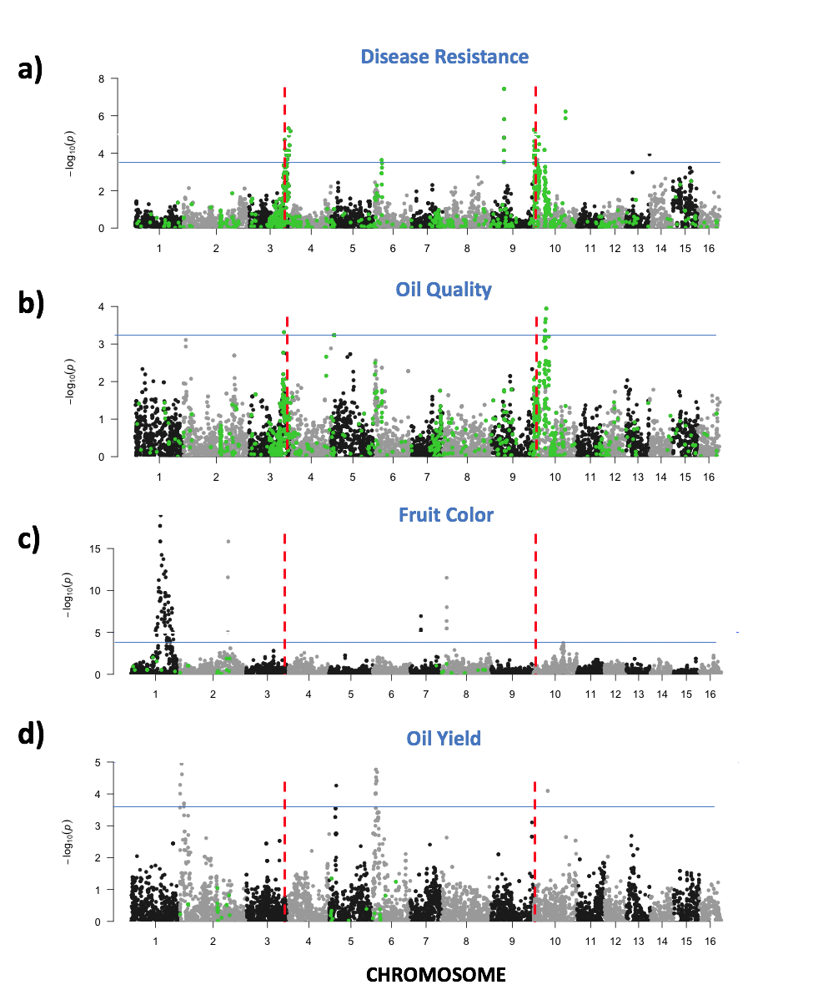

# Oil-Palm-Hybrids
Using genome seqeuncing technology to improve inter-species hybrid breeding

### PROJECT MOTIVATION/OBJECTIVE
Oil palm cultivars are highly susceptible to a number of diseases. The potential social and economic risk involved to the multibillion-dollar industry has prompted the Malaysian oil palm government to start breeding disease resistant oil palm cultivars. Breeders have identified disease resistant wild oil palm endemic to Latin America--a sister species of the African cultivated variety (diverged 50 Mya). To generate palms that express disease resistance as well as other agronomically valuable wild traits, the breeders cross-bred wild Latin American with African cultivated palms to produce several generations of hybrids. However, despite three generations of selective breeding, the hybrid palms did not express the desirable wild traits of interest. Here we use genomic sequencing to identify the genetic source preventing the transfer of wild traits into hybrid populations.

### PARTNER
[Malaysian Oil Palm Board](http://www.mpob.gov.my/)

### DATA SETS
* Genetic variation sequencing data (samples size = 228)
* Oil Palm reference genome sequence

### METHODS
* Chi-squared test (custom script: chisquared_test.py)
* Functional characterization of genes
  * Protein coding gene sequence extraction from genome (custom script: extract_gene_seq.py)
    - Download input/output files from [here](https://www.dropbox.com/sh/hmzssojdk0m4qi7/AACzlYJK3cD1m6K8IeOSzsJ2a?dl=0)
  * Translate gene sequences to protein sequences
    - Download EMBOSS command-line tool [here](http://emboss.sourceforge.net/download/)
    - command-line function: <input> transeq eg9_cds_genes.fasta eg9_proteins.pep -trim Y
  * Genomic sequence alignments ([BLAST sequence alignment tool](https://blast.ncbi.nlm.nih.gov/Blast.cgi))
    - To run BLAST, you can download command-line tool [here](https://blast.ncbi.nlm.nih.gov/Blast.cgi?CMD=Web&PAGE_TYPE=BlastDocs&DOC_TYPE=Download)
    - Map oil palm protein sequences to a functionally well annotated plant genome (i.e. Arabidopsis).
    - Filter BLAST results to extract reliable sequence results (custom Python script: blast_filter.py)
* Data visualization (R, ggplot)

### PROJECT DESCRIPTION
We hypothesize that genes associated with traits that are under-represented in the hybrid populations are linked to unfavorable combinations of genes that are reproductively disadvantageous (e.g. pollen inviability/sterility). We can identify unfavorable combinations of genes by comparing gene/allele frequencies in the population of hybrids to that of the expected population frequency inferred from the parents. 

* I used a simple chi-square test to scan the 1.8Gb genome for regions that deviate from expected gene ratios (estimated from the parental genetic sequences) and see if these regions contain genes associated with wild traits of interest. 

* Because the gene functions were not well annotated in the oil palm genome, I wasn't able to infer potential genetic functions. To get around this issue, I mapped oil palm protein sequences onto a functionally well annotated plant genome (e.g., Arabidopsis) and inferred gene functions based on sequence similarities. I used a customized python script to extract gene sequences that were then translated into protein sequences and implemented BLASTP sequence alignment tool to infer oil palm gene functions. 

### RESULTS
* Results were experimentally validated and provided new innovative insights towards developing molecular gene editing techniques to improve inter-species hybrid breeding. 

* Identified several large genomic regions of unfavorable gene combinations in hybrid populations and found that genes significantly associated with wild traits of interests are located within these regions. The figure below is a karyogram of an example hybrid population. 

  - This figure represents hybrid chromosomes with genetic regions that correspond to regions that harbor wild (green), cultivated (pink) and unfavorable genes (blue). [Karyogram_BC2b_PollenValidation_Genotype_Rscript.R](Interspecies-oil-palm-hybrids/Figures_Scripts/Karyogram_BC2b_PollenValidation_Genotype_Rscript.R)

* Regions of unfavorable gene combinations contain genes responsible for pollen viability/sterility and other reproductive developmental traits, suggesting that genes associated with wild traits of interest may be linked to genes that cause reproductive abnormalities in hybrids thus are not represented in the hybrid populations. 

  - The figure below are manhattan plots from a genome-wide association analysis (associating genes to traits) for disease resistance, oil quality, fruit color and oil yield. Sharp peaks above the blue significance line correspond to regions that harbor genes significantly associated with the respective traits. The green dots correspond to regions that harbor unfavorable genes. The red line indicate the location of genes responsible for reproductive viability/sterility. Figures A) and B) are traits that are not expressed in hybrids. In contrast, figures C) and D) are traits that are expressed in hybrids. [ManhattanPlots.R](Interspecies-oil-palm-hybrids/Figures_Scripts/ManhattanPlots.R)

